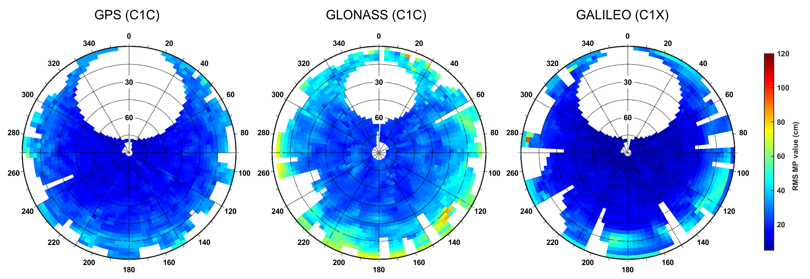

## anubis-matlab

Matlab tools for making of visuals from [Gnut-Anubis](http://www.pecny.cz/GOP/index.php/gnss/sw/anubis) XTR output files in skyplot representation. For polar plots [polarplot3d](https://www.mathworks.com/matlabcentral/fileexchange/13200-3d-polar-plot) Matlab function from Ken Garrard is used.

#### Description 

* `xtr2MPskyplot` create skyplot of MP combination for all available GNSS from XTR file
* `xtr2CSskyplot` plots skyplot of cycle-slip density (simple kernel density) for all GNSS together

#### Usage 
```matlab
% Add content of lib to path
addpath(genpath(anubis-matlab))

% Function's calls
xtr2MPskyplot('example/xtr/GANP.xtr','C1C')
xtr2CSskyplot('example/xtr/GANP.xtr')
```

#### Examples
<p align="center">
  
</p>
